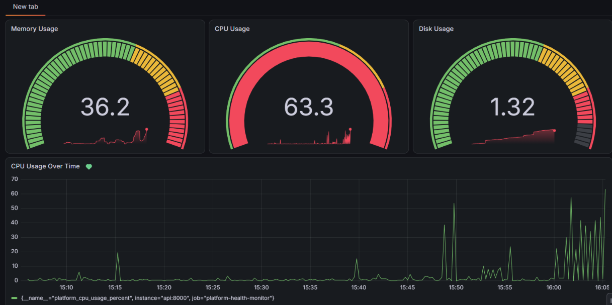

# Platform Health Monitor and Automation Tool

A containerized system monitoring application built with FastAPI, Prometheus, and Grafana. It collects system resource metrics, exposes health-check endpoints, visualizes performance through dashboards, and supports alerting for high CPU usage.

## Overview

The Platform Health Monitor provides a centralized way to monitor application and system health. FastAPI exposes health and resource metrics, Prometheus collects those metrics at regular intervals, and Grafana provides dashboards and alerting.

The project also includes automated API tests and a GitHub Actions CI pipeline to validate changes.

## Tech Stack

| Technology     | Purpose                               |
| -------------- | ------------------------------------- |
| Python         | Application logic                     |
| FastAPI        | REST API and health-check endpoints   |
| psutil         | System resource monitoring            |
| Prometheus     | Metrics collection and storage        |
| Grafana        | Monitoring dashboards and alert rules |
| Docker         | Application containerization          |
| Docker Compose | Running the services together         |
| Pytest         | Automated API testing                 |
| GitHub Actions | Continuous integration (CI)           |

## Architecture

```text
                 +----------------------+
                 |   FastAPI Application|
                 |  Health + System API |
                 +----------+-----------+
                            |
                      /metrics endpoint
                            |
                            v
                 +----------------------+
                 |      Prometheus      |
                 |  Scrapes every 5 sec |
                 +----------+-----------+
                            |
                            v
                 +----------------------+
                 |        Grafana       |
                 | Dashboards + Alerts  |
                 +----------------------+

       Docker Compose runs all three services.
       GitHub Actions runs API tests and validates
       the Docker image build.
```

### Main Components

* **FastAPI:** Exposes health status, system metrics, and Prometheus-compatible metrics.
* **Prometheus:** Scrapes the API's `/metrics` endpoint every five seconds.
* **Grafana:** Visualizes CPU, memory, and disk usage and evaluates the high-CPU alert rule.
* **Docker Compose:** Starts and manages the API, Prometheus, and Grafana services.
* **GitHub Actions:** Runs the automated tests and builds the Docker image on pushes and pull requests.
## Getting Started

### Prerequisites

Install the following:

* Docker Desktop with WSL integration enabled, or Docker Engine with Docker Compose
* Git

### 1. Clone the repository

```bash
git clone https://github.com/Muskan6505/platform-health-monitor.git
cd platform-health-monitor
```

### 2. Start the services

```bash
docker compose up --build -d
```

### 3. Check the containers

```bash
docker compose ps
```

### 4. Stop the services

```bash
docker compose down
```
## API Endpoints

| Endpoint         | Description                              |
| ---------------- | ---------------------------------------- |
| `/`              | Application welcome or status response   |
| `/health`        | Health status and monitoring information |
| `/api/v1/system` | Current CPU, memory, and disk metrics    |
| `/metrics`       | Prometheus-compatible metrics exposition |

The API is available at `http://localhost:8000` when the Docker Compose stack is running.
## Testing

The project includes automated API tests for:

* Home endpoint
* Health endpoint
* System metrics endpoint
* Prometheus metrics endpoint

To run the tests locally using the project's Python virtual environment:

```bash
source .venv/bin/activate
python -m pytest -v
```

### Continuous Integration

GitHub Actions automatically runs the API tests and validates the Docker image build when code is pushed to `main` or a pull request targets `main`.

## Dashboard Preview

